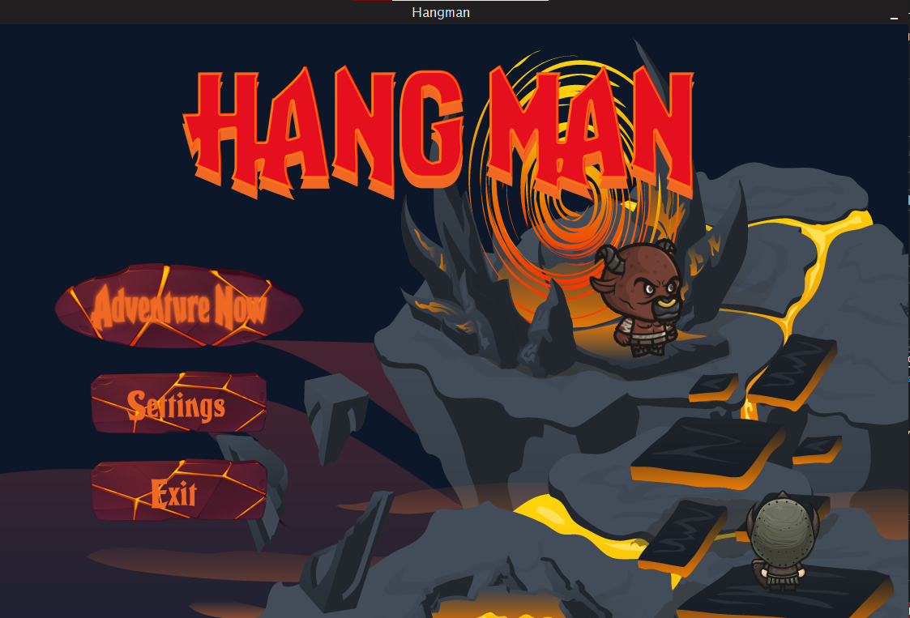
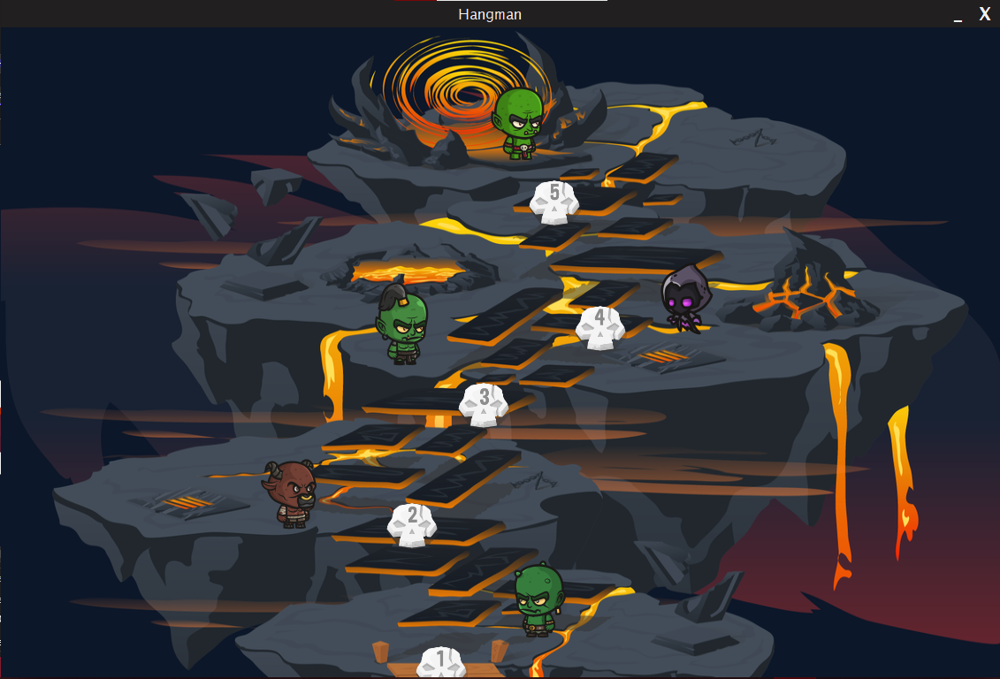
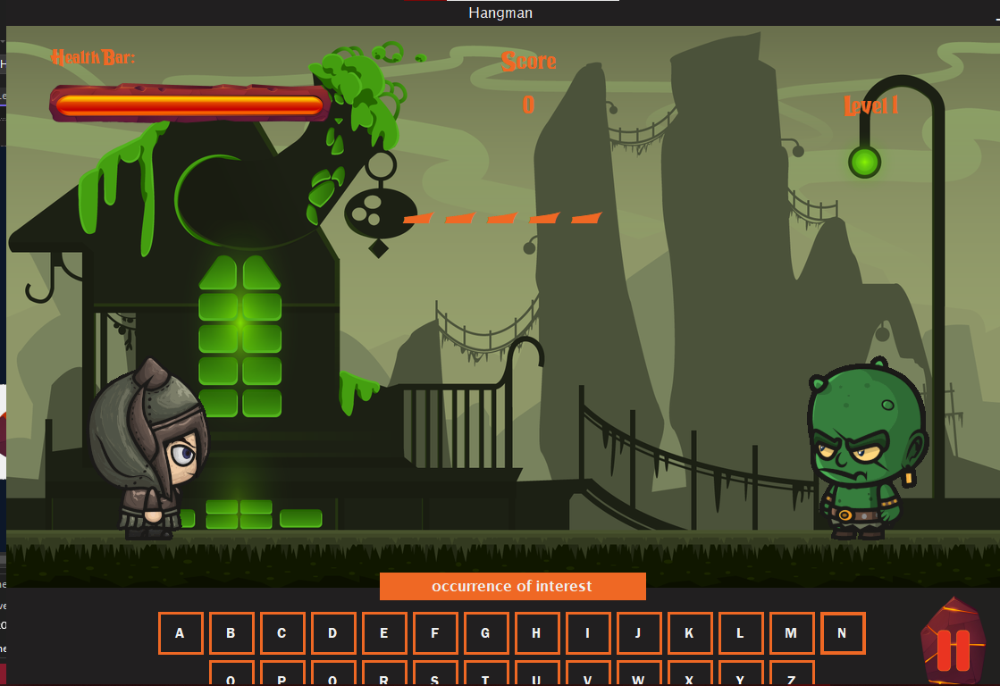

# ⚔️ Hangman Battle — C# WinForms Game

**Hangman Battle** is a reimagined version of the classic Hangman game, built with **C# and Windows Forms**. In this version, players engage in a turn-based battle against a monster by guessing letters. The game features **5 levels**, each increasing in difficulty, with a visual and interactive interface including character sprites, health bars, and animated actions.

---

## 🎮 Gameplay Overview

- 🧠 **Guess a letter:**  
  - ✅ If correct → the player attacks the monster!
  - ❌ If wrong → the monster hits back!
  
- ⚔️ **Progress through 5 levels** of increasing difficulty.
- Each level has a unique monster with more health and harder words.

---

## ✨ Features

- 🎮 Classic Hangman mechanic combined with battle gameplay
- ⚔️ Turn-based player vs. monster combat
- 🧩 5 progressively challenging levels
- 📊 Dashboard overview with stats and level selection
- 💬 In-game feedback for attack, defense, and damage
- 🎨 Visual health bars, word progress, and character art
- 🔁 Replayable from any level

---

## 🖼️ Screenshots

### 🧭 Dashboard

> Overview of game progress, stats, and level selection  


### 🗺️ Level Selection

> Choose between 5 levels, each with its own monster and word pool  


### 🧠 Game Interface

> Game screen showing player, monster, word progress, and battle effects  



---

## 🛠️ Built With

- C# (.NET)
- Windows Forms (WinForms)
- Visual Studio 2022 or newer

---

## 🚀 Getting Started

### Prerequisites

- Windows OS
- Visual Studio with .NET Desktop Development workload
- .NET Framework or .NET 6/8

### How to Run

1. Clone the repository:
   ```bash
   git clone https://github.com/your-username/HangmanBattle.git

🙌 Credits

Sprite Assets provided by **Craftpix.net**
Please visit their site to view and support their amazing game assets!

📄 License

This project is open-source and made for **educational and entertainment purposes**.
